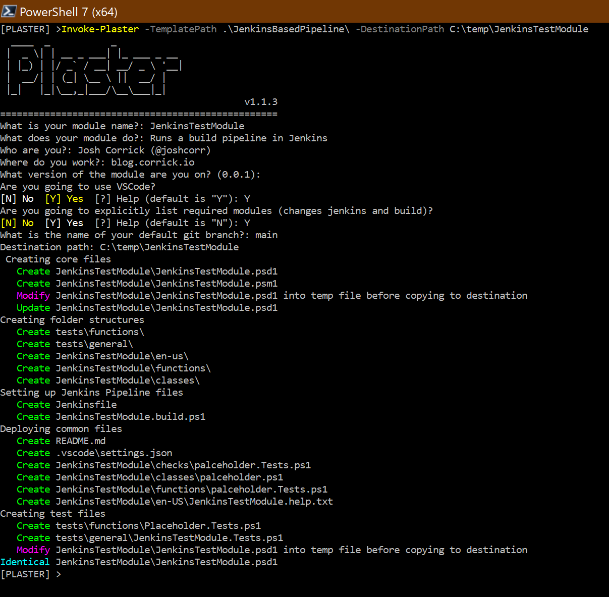

# Jenkins Based Pipeline Template

This example shows using Plaster variables in non powershell files to quickly layout not only the module but supporting files (such as Jenkins, Invoke-Build, and VSCode settings)

There are also some examples of Dependency loading in the Build.ps1 for modules which require specific versions.

Note: some of the code in the Jenkinsfile assumes you are using a UserName/Password between Jenkins and your git source, which may not be the best way to do it.

The following command was run from inside the root of the PlasterTemplates repo.
