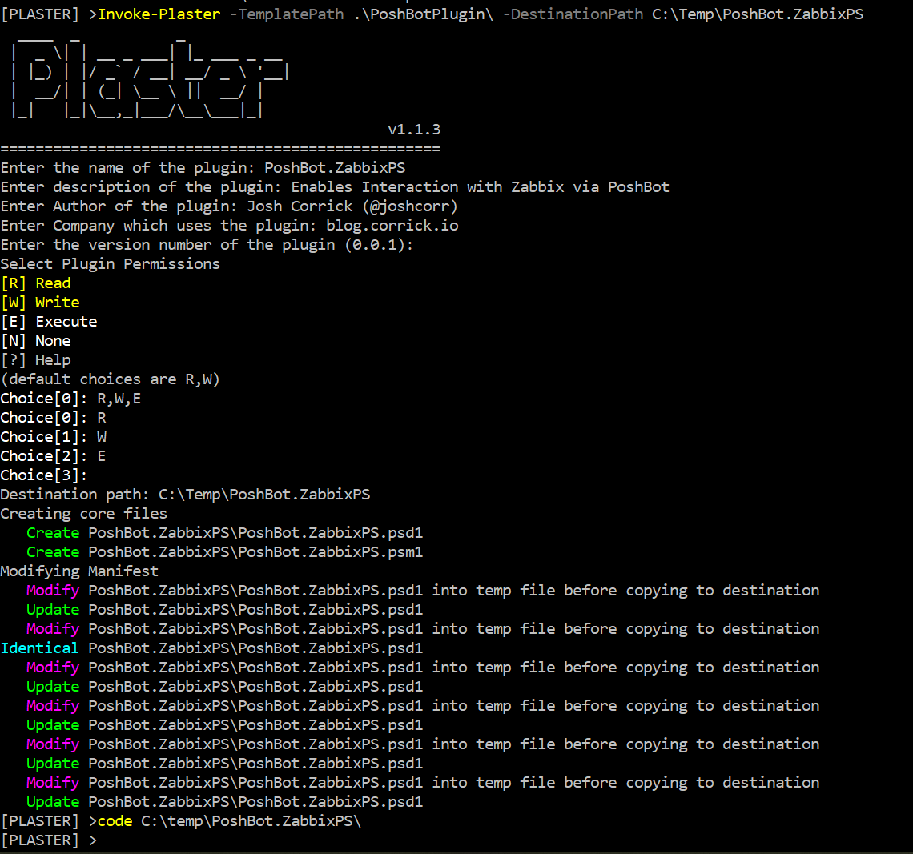

# PoshBotPlugin

Started developing poshbot plugins and got tired of copy the permissions in to the PSData, so templated it out. Also enjoyed figuring out creative ways with the Replace plaster function to inject a new hashtable.

### Use
The following command was run from inside the root of the PlasterTemplates repo.
